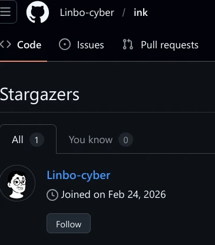

# 不要老是想着搞个大新闻

虽然看到这篇文章的人可能对前因后果都有所了解，或者已经阅读过 `Linbo-cyber` 先生 (或者女士?) 的大作了，不过仍然在此假定读者对此一概不知情。
所以，让我们一段一段来，聊聊我，MCSeekeri，作为被抨击的对象是怎么看这篇惊世大作的。
[链接在此](https://linbo-cyber.github.io/posts/mcseekeri-roast.html)

## Part 1 : Attention is all your need

> [Naomi](https://github.com/MCSeekeri/Naomi) 自称是"自研系统"，但仓库内却携带了多个**智商侮辱性内容**

\*罐头笑声\*

> 首先是仓库的 Topics 标签带毒

\*稍微大一点的罐头笑声\*

> 然后是仓库根目录的 `flake.nix`
> …
> 此为 Naomi 的"自研"核心代码。此为从 NixOS 社区直接引用的别人写的工具。**两者完全一致。**

\*比刚才还大的罐头笑声\*

先抛开 Topics 标签带毒和这种神必 AI 风味用词不谈，我们聊聊 `flake.nix` 是什么。

> **Nix flakes** 是 Nix 2.4 版本中首次引入的一项实验性功能，旨在解决 Nix 生态系统许多领域的改进问题：它们为 Nix 项目提供了一个统一结构、允许固定每个依赖项的特定版本并通过锁文件共享这些依赖项，同时总体上使编写可复现的 Nix 表达式变得更加方便。
> …
> Flake 是一个直接包含 `flake.nix` 文件的目录，该文件内容遵循一种特定结构。Flakes 引入了一种类似 URL 的语法来指定远程资源。
> ————NixOS Wiki. Flakes/zh[EB/OL]. [2026-03-03]. <https://wiki.nixos.org/wiki/Flakes/zh>

换句话说，Nix 生态中的 Flakes 就是为了记录依赖的，类似于 Go 的 `go.mod`, Rust 的 `cargo.toml` 或者 npm 的 `package.json`，你显然不能指责一个用来包含依赖的文件……包含依赖，这口大锅可以扣给所有使用现代包管理器的项目。

> 因为时间原因，暂未对这些文件进行更细致的检查

很简单，clone 一下目录，然后在目录中执行 AI 代理就行了，写项目的时候天天 @claude，怎么这时候就不会了。
Naomi 是个很轻量的项目，剔除掉 Git 历史以及 `flake.lock` 文件之后只有不到 300KiB，任何一个现代模型就能在上下文中处理它，连 D 老师都有 1M 上下文了。

> 但是可以确定 Naomi 的所有"自研"内容并不是原创。仅仅是核心配置中就引用了至少**十几个**社区项目，可想而知所谓的"自研"含量是什么情况。

谁需要依赖库啊，真男人都是用打孔纸带写代码的。

> 值得注意的是，MCSeekeri 对大部分仓库**关闭了 Issue 和 PR**，这导致用户难以在使用前对代码质量进行反馈，项目是否靠谱完全依赖于作者的技术水平与自我认知。

哦这个确实是对的，我关闭了大部分项目的 Issue 和 PR，因为一个有用的 PR 可遇不可求，这东西跟天上掉下免费劳动力的概率差不多。
至于 Issue，前一阵子有个不知道哪来的傻逼操着 AI 在我的自用项目里面拉屎，所以决定关掉清静一下，现在已经打开供大家品鉴了。

<https://github.com/MCSeekeri/Minecraft/issues/1>
<https://github.com/MCSeekeri/hmcl/issues/1>
<https://github.com/MCSeekeri/hmcl/issues/2>

> 同时，MCSeekeri 大量 fork 了社区项目（RSSHub、lobehub、nixpkgs、waline 等），享受着开源社区的一切成果，却不允许任何人对他的项目提出意见。

只是顺带一提，Naomi 是在 Codeberg 上开发的，那上面是开放 PR 的，而且我的邮箱一直挂在个人页面上……

> Naomi 已经在 GitHub 上存在了相当一段时间，作者却连最基本的**诚实描述**都做不好。如果是因为认知不足，那么显然没有理由继续相信这么一个不靠谱的人；如果是有意为之……
> **……那最好仔细检查你的大脑是否安全。**

呃。

## Part 2 : All your config are belong to us

> 这就是他的"自研系统核心代码"。设置了一个主机名，声明了 CPU 类型是 qemu 虚拟机，指定了一个版本号。**三行配置，幼儿园水平。**

差不多，Nix 最大的优势就是幼儿园小孩都能写出来操作系统。
哎你说我是不是可以办少儿编程班了，不教 Python 也不教屎瓜奇，就教 Haskell，函数式编程！

> 把这些东西拆成单独的文件，然后声称自己做了"模块化架构"，就像你把一篇作文的每个自然段存成单独的 Word 文档，然后说自己发明了"分布式文档管理系统"。
> …
> 更关键的是：**这些配置完全是为他自己的机器写的。**
> …
> 你不可能拿他的主机名、他的硬件配置、他的个人偏好来用在自己的机器上。

还真可以。
实际上，这就是为啥我拆一堆 modules 而不是放六个硕大无比的 `configuration.nix` 的一样。
最终用户可以新建一个主机配置，然后 imports 一大堆 ${self}/modules，然后它就跑起来了。
所以 Naomi 中存在一些 assertion，防呆设计，防止最终用户整了什么花活把配置送走。

> 这就是为什么 GitHub 上有个分类叫 `dotfiles`——因为这类东西的本质就是**个人配置备份**，方便自己换机器的时候恢复环境。它的受众是且仅是作者本人。

你猜 Topics 里面有没有 `dotfiles`。
不过这个问题确实存在，目前的 Naomi 和我个人的一些配置耦合了，可以拆分但暂时没必要。因为我作为这玩意的唯一用户，如果我都不把这玩意放在生产环境里跑，谁还敢？

> - 代码质量：照抄官方文档 + 一行配置拆一个文件
> - 适用范围：仅限作者本人的几台机器
> - 社区价值：零（4 颗星，其中大概率包含自己的同情星）
> - 对外宣传：自研系统

我寻思我没给自己点过 Star 啊，让我看看是谁这么干过。

呃，嗯……

> 如果说 Naomi 只是自欺欺人的虚假宣传，那么 CE-RAMOS 事件就是实打实的恶意造谣。

？！这么强！？

我是婊子吗（喵梦脸

## Part 3 : 0xBADC0FFEE

> - **Ventoy** 本身就是杀软误报重灾区，官方 FAQ 专门有一节解释这个问题
> - **Everything** 和 **CPU-Z** 在 PE 环境中重新封装后，哈希值与官方原版不同是正常现象——因为 PE 需要对工具做适配修改
> - PE 系统打包第三方工具时，杀软误报率极高，这是**行业常识**
> …
> MCSeekeri 的文章里，"误报"这两个字**一次都没出现**。他直接跳过了最基本的排除步骤，把杀软的扫描结果当成了铁证，然后用"有意为之"四个字完成了从"技术分析"到"人身攻击"的华丽转身。

你知道吗，一些"大模型"在训练的时候错误的将"引号"的"强调作用"理解错了，所以说话就会很"奇怪"。

CE-RAMOS 这个事，哎呀……从何说起呢。

已知，Ventoy 会被杀毒软件误报。
又知，CE-RAMOS 内置的 Ventoy 被 VirusTotal 报毒。
可得是误报，Q.E.D.

又知，Github Release 中的 Ventoy 没有被报毒，和 CE-RAMOS 所使用的同一版本的 Ventoy 也没有被报毒且哈希对不上。
嗯……谁来给我一个令人信服的解释？

别告诉我开发者还顺手给 Ventoy 改了一部分还加了个 UPX 再发布的。

这些工具本身都很接近绿色软件，上游产物在大部分 PE 中都能稳定的跑起来，怎么到了你这还非得重新封装顺便改改二进制呢？
如果用的是汉化版本或者软件本身需要破解就算了，Ventoy 这种工具有什么修改的必要吗？

那句话的意思也很简单，个人项目很难保证开发者做的完美无缺，我当时推断是开发者水平不太行，从什么国内下载站整来的文件，没注意到不对劲就带进去了，和"开发者有意投毒谋害用户"差别大得很。
君不见多年前强如网易也发布了带毒的 iOS 客户端吗，总不能说网易是有意投毒吧。

算了可能是我不懂 Windows，毕竟我确实很久很久没用过 Windows 了，也许 PE 开发领域确实存在这种情况。

所以那篇文章发布之后没多久我就把它删除了。

## Part 4: Clawdbot，你把多少人的生活……

> CE-RAMOS 的作者遭到大规模网暴。

暴在哪？

> 一个花了一年多时间、迭代到 V2.3 PRO 版本的项目，**被迫停服**。

Pro……我是说，迫在哪？

> 现在访问 [ce-ramos.cn](https://ce-ramos.cn)，你只会看到：
> > **该项目已停止服务**
>
> 六个字。一年多的心血，六个字收场。

虽然有点不合气氛，但这是八个字，我就说大模型数数不行吧……

> MCSeekeri 在文章里还特意提到 CE-RAMOS 的插件加密密码是 `ZQFa08hkGv2@F`，并以此暗示"开发团队的人品值得怀疑"。

呃，这个密码是写在 CE-RAMOS 文档上的，我只是想不明白，这年头 PE 的扩展包都没密码，你设置个密码的威胁模型在哪？防止邪恶的自动机器人偷走你的扩展？还是防止最终用户打开插件包看看里面有啥？

> 一个 0 粉丝的 GitHub 用户，在审判一个有实际用户的项目作者。此人来自新加坡，大概是觉得在本地 PE 圈找不到存在感，于是跑到中文互联网来刷存在感——顺便造个谣。

大↑模↓型↑，我前段时间 Github Profile 是 Private 的，所以所有的 API 都会读到 0 粉丝，0 commit，可以理解。

而且怎么还把我国籍给开了，我生是炎黄子孙，死是华夏之魂好吧。
真担心过几天就有人逼着我唱光我民族，促进大同了……

> **学习什么叫杀软误报**：这是 PE 圈的基础常识，不会的话建议退圈

圈？什么圈？生物圈？
圈子文化害死人呐，觉得我是同一个圈子的同行，眼红你的产品然后造谣来了？

> 本文基于公开信息整理，行文风格完全模仿 MCSeekeri 造谣 CE-RAMOS 时的原文结构。觉得读着不舒服？那你现在知道 CE-RAMOS 的作者当时是什么感受了。

@claude，帮我写一篇反讽文章，这里是链接，写完之后发到 Github，不要出错。

> 免责声明：本文仅供娱乐与记录用途，不针对任何特定个人，文中所有内容均来源于公开可查的互联网信息。如有雷同，纯属巧合。本站不对读者基于本文内容所做的任何行为承担责任。

话是这么说，但我怎么咂摸出一丝煽动别人网暴我的味道来？
免责声明：前面忘了后面忘了。

## Part 5-5-5-5-5

点点返回首页，让我们看看 `linbo-cyber`先生 (或者女士？) 的其他文章。

> Dario Amodei 可能是真心想做"负责任的 AI"。但在 3800 亿美元估值、2 亿美元军方合同、以及《国防生产法》的威胁面前，真心值多少钱？
> 答案是：不值钱。

哦原来是做负责任的 AI 啊，我还以为是在脑门上写"华人与狗不得使用"呢。

> 声明标题是：_"Statement from Dario Amodei on our discussions with the **Department of War**"_
>
> 注意——不是 "Department of Defense"，而是 **"Department of War"**。
>
> 这是美国国防部在 1947 年之前的旧称。Amodei 故意用了这个名字。翻译成人话就是：你们嘴上说"国防"，干的事情叫"战争"。

可能是查资料的时候查到了 1947 年改名为国防部，但是没往下多看几行，2025 年川普就把名字改回来了。

> 声明的前半段是一长串 Anthropic 主动为军方服务的功绩清单：
>
> - **第一个**在美国政府机密网络部署前沿 AI 模型
> - **第一个**部署到国家实验室
> - **第一个**为国家安全客户提供定制模型
> - 主动切断中国关联公司对 Claude 的访问，**放弃了数亿美元收入**
> - 阻止了中共支持的网络攻击
> - 公开倡导对华芯片出口管制
>
> 这段话的潜台词是：**别把我当敌人。我比你们任何一个承包商都爱国。但你们的要求过分了。**

原来是自愿放弃数亿美元收入啊，我还以为是反对邪恶的集权国家剽窃美国的新技术并保卫超级地球的民主自由呢。

> 这是最炸裂的一点。传统 PE 基本只能跑 Win32 应用，UWP 想都别想。但 JBT-RAMOS 做到了在 PE 环境下原生运行 UWP 应用。这意味着你可以在一个"维护系统"里跑微软商店应用、现代 UI 程序，甚至 Windows Media Player。
> 做过 PE 开发的人都知道这有多难——UWP 依赖一整套运行时环境和系统服务，在精简到极致的 PE 里把这些东西拉起来，需要对 Windows 内核和组件依赖关系有极深的理解。

那我 Wine 缺的这个开发人员，谁给我补啊。
认真的，Wine 确实没有 UWP 兼容，欢迎 PR.

> 如果你对 PE/RAMOS 感兴趣，强烈建议去试试。如果你只是路过，至少知道：在这个不起眼的小圈子里，有人在认真地做一件很酷的事。

真可惜，怎么不是写我呢……

> 曾用名：**爱斯码的小学生**。"斯码"谐音懂的都懂。不过按照他的被骂频率，估计已经没码（妈）可斯（死）了，怕是得去批发商那里进点才够用。这大概也解释了他为什么骚扰别人这么肆无忌惮——毕竟没人管教了。

呃。

> 通常来说，互联网上遇到烦人的人，拉黑就完事了。但当一个人的骚扰行为已经到了让多个不相关的人都忍无可忍的程度——JBT 专门做了个网页挂他，圈内多人都被他反复骚扰——那就有必要公开说一说了。

呃……

> 🕯 为此人上香
> 已有 63105 人上香
> 为此人哀悼
> 已有 66936 人前来哀悼

我觉得我们还是别看了吧。

## Part 6 : Soc-Eng

`linbo-cyber` 作为一个建立账号不到一个月 (发布文章时计算) 的 Github 用户，不仅整明白了 CE-RAMOS 事件的来龙去脉，还立马发文抨击我，为 CE-RAMOS 的开发者鸣不平。
一个大模型，毫无利己的动机，把 CE-RAMOS 的事业当作他自己的事业，这是什么精神？

我不到啊。

不过非常有趣的是，CE-RAMOS 的开发者 [NORMAL-EX](https://github.com/NORMAL-EX) 宣布了新项目 Cloud-PE，而 Cloud-PE 在 Github 上有 Repo，所以我能看到 NORMAL-EX 的其他项目

哦对了，不知道你们发现没，之前那个弱智 Issue 的提交者叫 [bilibili-down](https://github.com/bilibili-down)，而它唯一的 [Repo](https://github.com/bilibili-down/bilibili-down.github.io) 就是指向了 NORMAL-EX 的同名项目。
而 NORMAL-EX 还 Star 了 `linbo-cyber` 的两个 Repo.

我还需要多说什么吗？答案已经很明显了。
显然是有人恶意抹黑 NORMAL-EX，盗用他的账号，开小号骂我然后故意引我过去和他对线，故意挑拨我们两人之间的矛盾！

我好哥们 NORMAL-EX 本意是好的，都是盗号狗执行坏了！

## Epilogue: 保持你等候哈？

非常有趣的是，`Linbo-cyber` 在文章发布后一天，突然一改之前的态度，谦谦君子般的给我发了封邮件。
在这里附上我们之间邮件通信的全文。

> 发件人:linbo.work@outlook.com
> 收件人:mcseekeri@outlook.com
> 2026/2/26 00:29
> 关于 Naomi 项目的一些看法
>
> 你好 MCSeekeri，
>
> 我是 Lin Bo，最近在 GitHub 上看到了你的 Naomi 项目，也看到你在 B 站上宣传它。花了点时间把仓库翻了一遍，有些想法想直接跟你聊聊。
>
> 先说结论：把 Naomi 称为「自研系统」，这个说法有问题。
>
> 我看了 flake.nix、hosts 目录、modules 目录的内容，也看了 README。整个项目的本质是一套 NixOS 配置管理方案——基于 Nix Flakes 的多主机 dotfiles，配合 home-manager、disko、stylix 等社区工具做模块化管理。你自己的 repo topics 里也标着 dotfiles、nixos-configuration、home-manager。
>
> 这些东西确实有技术含量。Nix 的学习曲线很陡，能把多台机器的配置用 Flakes 组织得井井有条，说明你对 Nix 生态有不错的理解。模块化拆分（Core、Desktop、Server、Services）也做得比较清晰。
>
> 但「自研系统」这四个字，在技术圈里的含义是：你从底层开始构建了一个操作系统，或者至少在内核/系统层面做了实质性的开发工作。而 Naomi 做的事情是：用 Nix 语言编写配置文件，声明式地组装已有的软件包和服务。这是系统管理和配置工程，不是系统开发。
>
> 打个比方：用乐高积木搭了一个很酷的城堡，这值得展示，但你不能说自己「发明了一种新型建筑材料」。NixOS 是积木，Naomi 是你用积木搭的作品。
>
> 在 B 站用「自研系统」来宣传，对不了解 NixOS 的观众来说是误导性的。他们会以为你写了一个操作系统，而实际上你写的是配置文件。这种信息差如果被懂行的人指出来，对你的信誉反而是伤害。
>
> 建议：
>
> 1. 把「自研系统」改成「基于 NixOS 的定制系统方案」或「NixOS 配置框架」——README 里其实已经写了「基于 NixOS 的定制系统」，这个表述就准确得多
> 2. 在 B 站视频里明确说明 Naomi 是建立在 NixOS 之上的，重点展示你的配置管理思路和模块化设计
> 3. 这样反而更能吸引真正对 NixOS 感兴趣的受众，也不会被人质疑
>
> Nix 生态在国内还比较小众，能做出一套完整的多主机 Flake 配置方案本身就有价值，没必要用夸大的说法来包装。
>
> 以上纯属个人看法，如有冒犯请见谅。
>
> Lin Bo
> <linbo.work@outlook.com>

> 发件人:mcseekeri@outlook.com
> 收件人:linbo.work@outlook.com
> 2026/2/26 21:09
> Re:关于 Naomi 项目的一些看法
>
> 晚上 (或者早上？) 好。  
>
> 我不确定您的邮件是使用了 AI 润色，还是完全使用 AI 进行搜索和编写——那个乐高积木的比喻实在是既视感太重了——我不关心，这也不重要，这年头完全不使用 AI 才是怪事，但作为屏幕背后的人 (?)，我希望您能够独立完成事实查证。  
>
>
> 不过，本着假定善意的准则，我还是会回答您的问题。  
>
> 某蓝色高端男性论坛有过这样一句话："先问是不是，再问为什么"，Naomi 不是，未来也不会是一个自研操作系统，它所能做到的和大多数 GitHub 上的 dotfiles 没有本质上的区别，只不过有一个十分中二的项目名。我也不追求重新造轮子，倒不如说在已经有足够多优秀解决方案的时候，重新写一个实现往往会带来更多的问题。  
>
> Naomi 这个名字其实是一个冷笑话，跟 GNU is Not Unix 一样属于递归缩写，如果不是刚好想到了这个冷笑话，可能项目名称就只会起一个 MCSeekeri/dotfiles 这种无趣的名字。至于 README 里面提到的"定制系统"这个说法……在 GitHub 这种相对来讲比较严肃，各种概念炒作也没那么疯狂的地方，肯定不会有人真的把它当作一个"操作系统"，毕竟到底有几斤几两，点开代码看看就知道了。  
>
> 至于 B 站视频，那个其实是一个整活之作，作为视频网站，哔哩哔哩的科技区水平到底如何，你我心里都大概有个预期，各种 "初中生自研杀毒软件" "高中生自研系统内核" "中学生独立开发 [此处插入文本] OS" 的视频层出不穷。我制作那个视频单纯是为了巨魔一下那段时间莫名其妙火起来的自研系统视频，懂行的都懂，不懂的就……那就这么着吧。  
>
> 实际上，在视频的简介部分，我已经明确的表明了"Naomi 基于 NixOS，使用 Nixpkgs 的贡献"，给出了项目的 Codeberg 地址，以及视频中所展示的几乎所有内容的来源，比如用到的游戏，模型，美术资产什么的。额外声明一下，视频发布之初我就写明了这些内容，并非后补。如果真的有人连点击视频看看简介，进行事实查证的耐心都没有的话，那他们迟早都会被误导的。  
>
> 在可见的未来，Naomi 都会只是个人的余兴之作，NixOS 不适合向大众群体推广，事实上大部分 Linux 都不适合普通用户，从政企单位就能窥见一二，所以我也没有什么举起大旗，手捧声明式操作系统思想，高呼战无不胜的函数式编程理论万岁，带领群众向邪恶的专有软件堡垒微软轴心发起冲锋的想法。换句话说，在 B 站这种地方吸引对 NixOS 感兴趣的受众不在我的考虑范围内，技术的事情还是要在技术的平台解决。  
>
> 最后，仍然感谢您的来信，如果对项目未来的发展有什么其他的建议，也可以继续回复，或者开个 issue 慢慢聊。

\[一个半月的沉默\]

> 发件人:linbo.work@outlook.com
> 收件人:mcseekeri@outlook.com
> 2026/4/6 18:29
> Re: 关于 Naomi 项目的一些看法
> 你个飞了老冯的死玩意 快去死吧🤩🤩🤩

以上，这是我们之间邮件的原始内容。
到底谁是谁非，就留给阅读这篇文章的你去思考吧，相信你所相信的，永远不要看了一篇文章之后就全盘接受文章里的观点，也许我也是错的呢？

至于你问我对这件事情的看法？

> ……不是太单调了吗？不是没有对立统一，只有片面性了吗？让他们搞，猖狂进攻，上街游行，拿枪叛变，我都赞成。

本文 120% 由人类写成，没有任何 Token 在写作过程中受到伤害。
