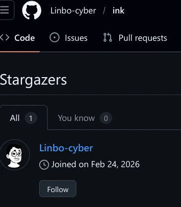
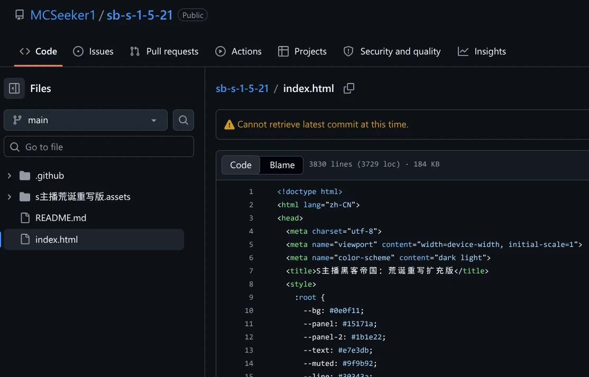

# 不要老是想着搞个大新闻

虽然看到这篇文章的人可能对前因后果都有所了解，或者已经阅读过 `Linbo-cyber` 先生 (或者女士?) 的大作了，不过仍然在此假定读者对此一概不知情。
所以，让我们一段一段来，聊聊我，MCSeekeri，作为被抨击的对象是怎么看这篇惊世大作的。
[链接在此](https://linbo-cyber.github.io/posts/mcseekeri-roast.html)

## Part 1 : Attention is all your need

> [Naomi](https://github.com/MCSeekeri/Naomi) 自称是"自研系统"，但仓库内却携带了多个**智商侮辱性内容**

\*罐头笑声\*

> 首先是仓库的 Topics 标签带毒

\*稍微大一点的罐头笑声\*

> 然后是仓库根目录的 `flake.nix`
> …
> 此为 Naomi 的"自研"核心代码。此为从 NixOS 社区直接引用的别人写的工具。**两者完全一致。**

\*比刚才还大的罐头笑声\*

先抛开 Topics 标签带毒和这种神必 AI 风味用词不谈，我们聊聊 `flake.nix` 是什么。

> **Nix flakes** 是 Nix 2.4 版本中首次引入的一项实验性功能，旨在解决 Nix 生态系统许多领域的改进问题：它们为 Nix 项目提供了一个统一结构、允许固定每个依赖项的特定版本并通过锁文件共享这些依赖项，同时总体上使编写可复现的 Nix 表达式变得更加方便。
> …
> Flake 是一个直接包含 `flake.nix` 文件的目录，该文件内容遵循一种特定结构。Flakes 引入了一种类似 URL 的语法来指定远程资源。
> ————NixOS Wiki. Flakes/zh[EB/OL]. [2026-03-03]. <https://wiki.nixos.org/wiki/Flakes/zh>

换句话说，Nix 生态中的 Flakes 就是为了记录依赖的，类似于 Go 的 `go.mod`, Rust 的 `cargo.toml` 或者 npm 的 `package.json`，你显然不能指责一个用来包含依赖的文件……包含依赖，这口大锅可以扣给所有使用现代包管理器的项目。

> 因为时间原因，暂未对这些文件进行更细致的检查

很简单，clone 一下目录，然后在目录中执行 AI 代理就行了，写项目的时候天天 @claude，怎么这时候就不会了。
Naomi 是个很轻量的项目，剔除掉 Git 历史以及 `flake.lock` 文件之后只有不到 300KiB，任何一个现代模型就能在上下文中处理它，连 D 老师都有 1M 上下文了。

> 但是可以确定 Naomi 的所有"自研"内容并不是原创。仅仅是核心配置中就引用了至少**十几个**社区项目，可想而知所谓的"自研"含量是什么情况。

谁需要依赖库啊，真男人都是用打孔纸带写代码的。

> 值得注意的是，MCSeekeri 对大部分仓库**关闭了 Issue 和 PR**，这导致用户难以在使用前对代码质量进行反馈，项目是否靠谱完全依赖于作者的技术水平与自我认知。

哦这个确实是对的，我关闭了大部分项目的 Issue 和 PR，因为一个有用的 PR 可遇不可求，这东西跟天上掉下免费劳动力的概率差不多。
至于 Issue，前一阵子有个不知道哪来的傻逼操着 AI 在我的自用项目里面拉屎，所以决定关掉清静一下，现在已经打开供大家品鉴了。

<https://github.com/MCSeekeri/Minecraft/issues/1>
<https://github.com/MCSeekeri/hmcl/issues/1>
<https://github.com/MCSeekeri/hmcl/issues/2>

> 同时，MCSeekeri 大量 fork 了社区项目（RSSHub、lobehub、nixpkgs、waline 等），享受着开源社区的一切成果，却不允许任何人对他的项目提出意见。

只是顺带一提，Naomi 是在 Codeberg 上开发的，那上面是开放 PR 的，而且我的邮箱一直挂在个人页面上……

> Naomi 已经在 GitHub 上存在了相当一段时间，作者却连最基本的**诚实描述**都做不好。如果是因为认知不足，那么显然没有理由继续相信这么一个不靠谱的人；如果是有意为之……
> **……那最好仔细检查你的大脑是否安全。**

呃。

## Part 2 : All your config are belong to us

> 这就是他的"自研系统核心代码"。设置了一个主机名，声明了 CPU 类型是 qemu 虚拟机，指定了一个版本号。**三行配置，幼儿园水平。**

差不多，Nix 最大的优势就是幼儿园小孩都能写出来操作系统。
哎你说我是不是可以办少儿编程班了，不教 Python 也不教屎瓜奇，就教 Haskell，函数式编程！

> 把这些东西拆成单独的文件，然后声称自己做了"模块化架构"，就像你把一篇作文的每个自然段存成单独的 Word 文档，然后说自己发明了"分布式文档管理系统"。
> …
> 更关键的是：**这些配置完全是为他自己的机器写的。**
> …
> 你不可能拿他的主机名、他的硬件配置、他的个人偏好来用在自己的机器上。

还真可以。
实际上，这就是为啥我拆一堆 modules 而不是放六个硕大无比的 `configuration.nix` 的一样。
最终用户可以新建一个主机配置，然后 imports 一大堆 ${self}/modules，然后它就跑起来了。
所以 Naomi 中存在一些 assertion，防呆设计，防止最终用户整了什么花活把配置送走。

> 这就是为什么 GitHub 上有个分类叫 `dotfiles`——因为这类东西的本质就是**个人配置备份**，方便自己换机器的时候恢复环境。它的受众是且仅是作者本人。

你猜 Topics 里面有没有 `dotfiles`。
不过这个问题确实存在，目前的 Naomi 和我个人的一些配置耦合了，可以拆分但暂时没必要。因为我作为这玩意的唯一用户，如果我都不把这玩意放在生产环境里跑，谁还敢？

> - 代码质量：照抄官方文档 + 一行配置拆一个文件
> - 适用范围：仅限作者本人的几台机器
> - 社区价值：零（4 颗星，其中大概率包含自己的同情星）
> - 对外宣传：自研系统

我寻思我没给自己点过 Star 啊，让我看看是谁这么干过。

呃，嗯……

> 如果说 Naomi 只是自欺欺人的虚假宣传，那么 CE-RAMOS 事件就是实打实的恶意造谣。

？！这么强！？

我是婊子吗（喵梦脸

## Part 3 : 0xBADC0FFEE

> - **Ventoy** 本身就是杀软误报重灾区，官方 FAQ 专门有一节解释这个问题
> - **Everything** 和 **CPU-Z** 在 PE 环境中重新封装后，哈希值与官方原版不同是正常现象——因为 PE 需要对工具做适配修改
> - PE 系统打包第三方工具时，杀软误报率极高，这是**行业常识**
> …
> MCSeekeri 的文章里，"误报"这两个字**一次都没出现**。他直接跳过了最基本的排除步骤，把杀软的扫描结果当成了铁证，然后用"有意为之"四个字完成了从"技术分析"到"人身攻击"的华丽转身。

你知道吗，一些"大模型"在训练的时候错误的将"引号"的"强调作用"理解错了，所以说话就会很"奇怪"。

CE-RAMOS 这个事，哎呀……从何说起呢。

已知，Ventoy 会被杀毒软件误报。
又知，CE-RAMOS 内置的 Ventoy 被 VirusTotal 报毒。
可得是误报，Q.E.D.

又知，Github Release 中的 Ventoy 没有被报毒，和 CE-RAMOS 所使用的同一版本的 Ventoy 也没有被报毒且哈希对不上。
嗯……谁来给我一个令人信服的解释？

别告诉我开发者还顺手给 Ventoy 改了一部分还加了个 UPX 再发布的。

这些工具本身都很接近绿色软件，上游产物在大部分 PE 中都能稳定的跑起来，怎么到了你这还非得重新封装顺便改改二进制呢？
如果用的是汉化版本或者软件本身需要破解就算了，Ventoy 这种工具有什么修改的必要吗？

那句话的意思也很简单，个人项目很难保证开发者做的完美无缺，我当时推断是开发者水平不太行，从什么国内下载站整来的文件，没注意到不对劲就带进去了，和"开发者有意投毒谋害用户"差别大得很。
君不见多年前强如网易也发布了带毒的 iOS 客户端吗，总不能说网易是有意投毒吧。

算了可能是我不懂 Windows，毕竟我确实很久很久没用过 Windows 了，也许 PE 开发领域确实存在这种情况。

所以那篇文章发布之后没多久我就把它删除了。

## Part 4: Clawdbot，你把多少人的生活……

> CE-RAMOS 的作者遭到大规模网暴。

暴在哪？

> 一个花了一年多时间、迭代到 V2.3 PRO 版本的项目，**被迫停服**。

Pro……我是说，迫在哪？

> 现在访问 [ce-ramos.cn](https://ce-ramos.cn)，你只会看到：
> > **该项目已停止服务**
>
> 六个字。一年多的心血，六个字收场。

虽然有点不合气氛，但这是八个字，我就说大模型数数不行吧……

> MCSeekeri 在文章里还特意提到 CE-RAMOS 的插件加密密码是 `ZQFa08hkGv2@F`，并以此暗示"开发团队的人品值得怀疑"。

呃，这个密码是写在 CE-RAMOS 文档上的，我只是想不明白，这年头 PE 的扩展包都没密码，你设置个密码的威胁模型在哪？防止邪恶的自动机器人偷走你的扩展？还是防止最终用户打开插件包看看里面有啥？

> 一个 0 粉丝的 GitHub 用户，在审判一个有实际用户的项目作者。此人来自新加坡，大概是觉得在本地 PE 圈找不到存在感，于是跑到中文互联网来刷存在感——顺便造个谣。

大↑模↓型↑，我前段时间 Github Profile 是 Private 的，所以所有的 API 都会读到 0 粉丝，0 commit，可以理解。

而且怎么还把我国籍给开了，我生是炎黄子孙，死是华夏之魂好吧。
真担心过几天就有人逼着我唱光我民族，促进大同了……

> **学习什么叫杀软误报**：这是 PE 圈的基础常识，不会的话建议退圈

圈？什么圈？生物圈？
圈子文化害死人呐，觉得我是同一个圈子的同行，眼红你的产品然后造谣来了？

> 本文基于公开信息整理，行文风格完全模仿 MCSeekeri 造谣 CE-RAMOS 时的原文结构。觉得读着不舒服？那你现在知道 CE-RAMOS 的作者当时是什么感受了。

@claude，帮我写一篇反讽文章，这里是链接，写完之后发到 Github，不要出错。

> 免责声明：本文仅供娱乐与记录用途，不针对任何特定个人，文中所有内容均来源于公开可查的互联网信息。如有雷同，纯属巧合。本站不对读者基于本文内容所做的任何行为承担责任。

话是这么说，但我怎么咂摸出一丝煽动别人网暴我的味道来？
免责声明：前面忘了后面忘了。

## Part 5-5-5-5-5

点点返回首页，让我们看看 `linbo-cyber`先生 (或者女士？) 的其他文章。

> Dario Amodei 可能是真心想做"负责任的 AI"。但在 3800 亿美元估值、2 亿美元军方合同、以及《国防生产法》的威胁面前，真心值多少钱？
> 答案是：不值钱。

哦原来是做负责任的 AI 啊，我还以为是在脑门上写"华人与狗不得使用"呢。

> 声明标题是：*"Statement from Dario Amodei on our discussions with the **Department of War**"*
>
> 注意——不是 "Department of Defense"，而是 **"Department of War"**。
>
> 这是美国国防部在 1947 年之前的旧称。Amodei 故意用了这个名字。翻译成人话就是：你们嘴上说"国防"，干的事情叫"战争"。

可能是查资料的时候查到了 1947 年改名为国防部，但是没往下多看几行，2025 年川普就把名字改回来了。

> 声明的前半段是一长串 Anthropic 主动为军方服务的功绩清单：
>
> - **第一个**在美国政府机密网络部署前沿 AI 模型
> - **第一个**部署到国家实验室
> - **第一个**为国家安全客户提供定制模型
> - 主动切断中国关联公司对 Claude 的访问，**放弃了数亿美元收入**
> - 阻止了中共支持的网络攻击
> - 公开倡导对华芯片出口管制
>
> 这段话的潜台词是：**别把我当敌人。我比你们任何一个承包商都爱国。但你们的要求过分了。**

原来是自愿放弃数亿美元收入啊，我还以为是反对邪恶的集权国家剽窃美国的新技术并保卫超级地球的民主自由呢。

> 这是最炸裂的一点。传统 PE 基本只能跑 Win32 应用，UWP 想都别想。但 JBT-RAMOS 做到了在 PE 环境下原生运行 UWP 应用。这意味着你可以在一个"维护系统"里跑微软商店应用、现代 UI 程序，甚至 Windows Media Player。
> 做过 PE 开发的人都知道这有多难——UWP 依赖一整套运行时环境和系统服务，在精简到极致的 PE 里把这些东西拉起来，需要对 Windows 内核和组件依赖关系有极深的理解。

那我 Wine 缺的这个开发人员，谁给我补啊。
认真的，Wine 确实没有 UWP 兼容，欢迎 PR.

> 如果你对 PE/RAMOS 感兴趣，强烈建议去试试。如果你只是路过，至少知道：在这个不起眼的小圈子里，有人在认真地做一件很酷的事。

真可惜，怎么不是写我呢……

> 曾用名：**爱斯码的小学生**。"斯码"谐音懂的都懂。不过按照他的被骂频率，估计已经没码（妈）可斯（死）了，怕是得去批发商那里进点才够用。这大概也解释了他为什么骚扰别人这么肆无忌惮——毕竟没人管教了。

呃。

> 通常来说，互联网上遇到烦人的人，拉黑就完事了。但当一个人的骚扰行为已经到了让多个不相关的人都忍无可忍的程度——JBT 专门做了个网页挂他，圈内多人都被他反复骚扰——那就有必要公开说一说了。

呃……

> 🕯 为此人上香
> 已有 63105 人上香
> 为此人哀悼
> 已有 66936 人前来哀悼

我觉得我们还是别看了吧。

## Part 6 : Soc-Eng

`linbo-cyber` 作为一个建立账号不到一个月 (发布文章时计算) 的 Github 用户，不仅整明白了 CE-RAMOS 事件的来龙去脉，还立马发文抨击我，为 CE-RAMOS 的开发者鸣不平。
一个大模型，毫无利己的动机，把 CE-RAMOS 的事业当作他自己的事业，这是什么精神？

我不到啊。

不过非常有趣的是，CE-RAMOS 的开发者 [NORMAL-EX](https://github.com/NORMAL-EX) 宣布了新项目 Cloud-PE，而 Cloud-PE 在 Github 上有 Repo，所以我能看到 NORMAL-EX 的其他项目

哦对了，不知道你们发现没，之前那个弱智 Issue 的提交者叫 [bilibili-down](https://github.com/bilibili-down)，而它唯一的 [Repo](https://github.com/bilibili-down/bilibili-down.github.io) 就是指向了 NORMAL-EX 的同名项目。
而 NORMAL-EX 还 Star 了 `linbo-cyber` 的两个 Repo.

我还需要多说什么吗？答案已经很明显了。
显然是有人恶意抹黑 NORMAL-EX，盗用他的账号，开小号骂我然后故意引我过去和他对线，故意挑拨我们两人之间的矛盾！

我好哥们 NORMAL-EX 本意是好的，都是盗号狗执行坏了！

## Epilogue: 保持你等候哈？

非常有趣的是，`Linbo-cyber` 在文章发布后一天，突然一改之前的态度，谦谦君子般的给我发了封邮件。
在这里附上我们之间邮件通信的全文。

> 发件人:<linbo.work@outlook.com>
> 收件人:<mcseekeri@outlook.com>
> 2026/2/26 00:29
> 关于 Naomi 项目的一些看法
>
> 你好 MCSeekeri，
>
> 我是 Lin Bo，最近在 GitHub 上看到了你的 Naomi 项目，也看到你在 B 站上宣传它。花了点时间把仓库翻了一遍，有些想法想直接跟你聊聊。
>
> 先说结论：把 Naomi 称为「自研系统」，这个说法有问题。
>
> 我看了 flake.nix、hosts 目录、modules 目录的内容，也看了 README。整个项目的本质是一套 NixOS 配置管理方案——基于 Nix Flakes 的多主机 dotfiles，配合 home-manager、disko、stylix 等社区工具做模块化管理。你自己的 repo topics 里也标着 dotfiles、nixos-configuration、home-manager。
>
> 这些东西确实有技术含量。Nix 的学习曲线很陡，能把多台机器的配置用 Flakes 组织得井井有条，说明你对 Nix 生态有不错的理解。模块化拆分（Core、Desktop、Server、Services）也做得比较清晰。
>
> 但「自研系统」这四个字，在技术圈里的含义是：你从底层开始构建了一个操作系统，或者至少在内核/系统层面做了实质性的开发工作。而 Naomi 做的事情是：用 Nix 语言编写配置文件，声明式地组装已有的软件包和服务。这是系统管理和配置工程，不是系统开发。
>
> 打个比方：用乐高积木搭了一个很酷的城堡，这值得展示，但你不能说自己「发明了一种新型建筑材料」。NixOS 是积木，Naomi 是你用积木搭的作品。
>
> 在 B 站用「自研系统」来宣传，对不了解 NixOS 的观众来说是误导性的。他们会以为你写了一个操作系统，而实际上你写的是配置文件。这种信息差如果被懂行的人指出来，对你的信誉反而是伤害。
>
> 建议：
>
> 1. 把「自研系统」改成「基于 NixOS 的定制系统方案」或「NixOS 配置框架」——README 里其实已经写了「基于 NixOS 的定制系统」，这个表述就准确得多
> 2. 在 B 站视频里明确说明 Naomi 是建立在 NixOS 之上的，重点展示你的配置管理思路和模块化设计
> 3. 这样反而更能吸引真正对 NixOS 感兴趣的受众，也不会被人质疑
>
> Nix 生态在国内还比较小众，能做出一套完整的多主机 Flake 配置方案本身就有价值，没必要用夸大的说法来包装。
>
> 以上纯属个人看法，如有冒犯请见谅。
>
> Lin Bo
> <linbo.work@outlook.com>
>
> 发件人:<mcseekeri@outlook.com>
> 收件人:<linbo.work@outlook.com>
> 2026/2/26 21:09
> Re:关于 Naomi 项目的一些看法
>
> 晚上 (或者早上？) 好。  
>
> 我不确定您的邮件是使用了 AI 润色，还是完全使用 AI 进行搜索和编写——那个乐高积木的比喻实在是既视感太重了——我不关心，这也不重要，这年头完全不使用 AI 才是怪事，但作为屏幕背后的人 (?)，我希望您能够独立完成事实查证。  
>
>
> 不过，本着假定善意的准则，我还是会回答您的问题。  
>
> 某蓝色高端男性论坛有过这样一句话："先问是不是，再问为什么"，Naomi 不是，未来也不会是一个自研操作系统，它所能做到的和大多数 GitHub 上的 dotfiles 没有本质上的区别，只不过有一个十分中二的项目名。我也不追求重新造轮子，倒不如说在已经有足够多优秀解决方案的时候，重新写一个实现往往会带来更多的问题。  
>
> Naomi 这个名字其实是一个冷笑话，跟 GNU is Not Unix 一样属于递归缩写，如果不是刚好想到了这个冷笑话，可能项目名称就只会起一个 MCSeekeri/dotfiles 这种无趣的名字。至于 README 里面提到的"定制系统"这个说法……在 GitHub 这种相对来讲比较严肃，各种概念炒作也没那么疯狂的地方，肯定不会有人真的把它当作一个"操作系统"，毕竟到底有几斤几两，点开代码看看就知道了。  
>
> 至于 B 站视频，那个其实是一个整活之作，作为视频网站，哔哩哔哩的科技区水平到底如何，你我心里都大概有个预期，各种 "初中生自研杀毒软件" "高中生自研系统内核" "中学生独立开发 [此处插入文本] OS" 的视频层出不穷。我制作那个视频单纯是为了巨魔一下那段时间莫名其妙火起来的自研系统视频，懂行的都懂，不懂的就……那就这么着吧。  
>
> 实际上，在视频的简介部分，我已经明确的表明了"Naomi 基于 NixOS，使用 Nixpkgs 的贡献"，给出了项目的 Codeberg 地址，以及视频中所展示的几乎所有内容的来源，比如用到的游戏，模型，美术资产什么的。额外声明一下，视频发布之初我就写明了这些内容，并非后补。如果真的有人连点击视频看看简介，进行事实查证的耐心都没有的话，那他们迟早都会被误导的。  
>
> 在可见的未来，Naomi 都会只是个人的余兴之作，NixOS 不适合向大众群体推广，事实上大部分 Linux 都不适合普通用户，从政企单位就能窥见一二，所以我也没有什么举起大旗，手捧声明式操作系统思想，高呼战无不胜的函数式编程理论万岁，带领群众向邪恶的专有软件堡垒微软轴心发起冲锋的想法。换句话说，在 B 站这种地方吸引对 NixOS 感兴趣的受众不在我的考虑范围内，技术的事情还是要在技术的平台解决。  
>
> 最后，仍然感谢您的来信，如果对项目未来的发展有什么其他的建议，也可以继续回复，或者开个 issue 慢慢聊。

\[一个半月的沉默\]

> 发件人:<linbo.work@outlook.com>
> 收件人:<mcseekeri@outlook.com>
> 2026/4/6 18:29
> Re: 关于 Naomi 项目的一些看法
> 你个飞了老冯的死玩意 快去死吧🤩🤩🤩

以上，这是我们之间邮件的原始内容。
到底谁是谁非，就留给阅读这篇文章的你去思考吧，相信你所相信的，永远不要看了一篇文章之后就全盘接受文章里的观点，也许我也是错的呢？

至于你问我对这件事情的看法？

> ……不是太单调了吗？不是没有对立统一，只有片面性了吗？让他们搞，猖狂进攻，上街游行，拿枪叛变，我都赞成。

本文 120% 由人类写成，没有任何 Token 在写作过程中受到伤害。

## Part VII: 击败博士与哈比下先生之奇案

我生下来便拥有一笔巨大的财产。此外，我自身天赋甚厚，生性勤勉，喜欢赢得同侪中智者贤人的尊敬。由此可想而知，凡是保障锦绣前程所需要的一切条件我都具备。诚然，我最坏的毛病是闲不住、图快活，这种性情曾使许多人得到幸福，但我却发现它同我的强烈的愿望——在人前昂首挺胸、保持非常庄重的仪态——很难调和。于是我就在私下偷偷地寻欢作乐；当我达到认真思考的年龄，开始环顾周围并对自己在社会上的前途和地位作出估价时，我已经深深地陷入这种生活的两面性而不克自拔。许多人要是犯有类似我这样的毛病，甚至会引以为荣；然而，我从自己的远大抱负出发，几乎怀着一种病态的羞愧看待并掩盖这种反常心理。因此，与其说是我的缺点中有什么特殊的堕落倾向，毋宁说是我的抱负之大把我造成了那个样子，并且把区分和合成人的两重性的善与恶两大范畴在我身上切割得比大多数人更为壁垒分明。在这样的情况下，作为宗教的根本，同时又作为苦恼最充沛的源泉之一，严峻的生活法则，在我心目中无可挽回地引起了深刻的怀疑。尽管我具有如此深刻的两重性，但我决不是伪君子；我的两个方面都是极其真诚的。我在光天化日之下努力钻研学问或减轻别人痛苦的时候，和甩开一切约束、一头扎进丑事堆的时候，同样都不是做假。我的科研方向完全针对神秘的、超出一般经验的课题，那时凑巧有了一些苗头，对这种长期自我冲突的意识起了很大的澄清作用。我从我的智力的两个方面——道德的和理性的——一天天稳步迫近这样一个真理（仅仅由于部分地发现了这个真理，我就注定要遭到如此可怕的毁灭）：人事实上不是单一的，而是二元的。我只说二元的，因为我自己的认识水平还没有超出这一点。沿着同一条道路，比起我来，别人将后来居上。我斗胆预料，将来最终会知道，人无非是由形形色色自相矛盾而又各自独立的居住者组成的一个政治实体。就我来说，我从自己生命的本性出发，始终朝着一个方向，也仅仅朝着一个方向前进。我是在道德方面通过亲身体验看透人的十足而原始的两重性的。我认识到，在我的意识领域内有两种本性在斗争，即使有充分理由说我属于其中之一，也无非因为从根本上讲这两者我都具备。早在我的科学发现的趋向开始一清二楚地显示这种奇迹的可能性之前，我已经学会像做一个心爱的白日梦那样，津津有味地反复思考使两者分离这样一个主意。我对自己说，如果能把这两者分别置于各自的本体内，生活将摆脱不能容忍的一切：不义者可以从他较正直的孪生兄弟的远大志向和良心不安中解脱出来，走自己的路；正义者可以坚定而安全地走他的上坡路，做他引以为乐的好事，再也不受那个身外的恶鬼牵累而出丑和忏悔。这样互相排斥的两抱柴被捆在一起，使这对分属两个极端的孪生兄弟老是没完没了地在饱尝苦楚的意识的孕育处格斗，乃是人类的祸祟。那么，怎样才能使这两者分离呢？
我一直在冥思苦想，忽然，刚才我已经说过，在实验台上获得的一些成果从侧面为这一课题提供了启示。我开始比以往更深切地领会到，我们所套上的那个看起来如此坚固的躯壳，其实是虚幻而缥缈的。我发现某些药剂具有抖掉和扯去那个臭皮囊的力量，恰如一阵风能把帐篷的帘幔吹开一般。由于两个可以理解的原因，我不愿就我这份供状的科学部分作深入的阐述。第一、因为事实使我懂得，我们的生活的厄运和重负永远压在人的肩膀上，每一次抛开它们的尝试只会变成一种更不习惯和更可怕的压力反弹到我们身上。第二、因为我的发现是不完全的，这一点可从下文看清楚。（可惜的是太清楚了！）只消说，我不仅能把我的自然躯体与构成我的精神的某些力量的气和光区分开来，而且配制成一种药，可以把这些力量从它们的宝座上赶下台，代之以第二种形状和相貌；第二种形象对我来说是同样自然的，因为那是我灵魂中卑下情操的表现并打上了它们的烙印。
我把这项理论付诸实践之前犹豫了很久。我清楚地知道我有丢掉性命的危险，因为能如此有效地控制和动摇本体之堡垒的任何药物，只要过量微乎其微的一点点或服用的时机稍有不当，就能把我盼望着药物加以改变的那个虚幻的肉体整个消灭掉。但是，作出如此不同寻常而意义深远的发现这种诱惑太大了，终于战胜重重疑虑。我早已准备好我的酊剂，于是立刻向某药品批发公司购进一大宗盐类，我根据所做的试验知道，只要有了这最后一种药品，便万事俱备了。于是，在一个可诅咒的夜里，我把各种成分合在一起，看它们在杯子里沸腾、冒气；等气泡消失以后，我就鼓足勇气把这杯药喝了下去。
接着尝到的是最难熬的苦楚：骨头里嘎嘎作声，胸中恶心得要命，还有一种精神上的恐惧，即使在出生或死亡的时刻也不可能比这更甚。后来剧痛迅速平静下来，我像生过一场大病似地悠悠苏醒。我的感觉有点异样，并且无法形容地新奇，也正因其新而难以置信地甜蜜。我觉得自己的身体变得比较年轻、矫捷、快活了。我内心意识到一种卤莽的冲动，一连串纷乱的纵欲映象犹如推动水车的湍流在我想象中奔泻。我意识到义务的束缚已被挣脱，灵魂得到了一种过去从未体验过的，但并非纯洁无邪的自由。这种新的生活刚一开始，我就知道自己比过去坏，坏上十倍，知道我已被出卖给原罪作奴隶。在那一瞬间，这个念头像一种酒使我振奋、高兴。我伸出双手，陶醉在这些新鲜的感受中；与此同时，我突然发觉身材变得矮小了。
当时我室内没有镜子；我写这个材料时旁边竖着的一面穿衣镜是以后拿来的，目的正是为了观察这种变形的过程。且说那一夜早就过去，时间已是翌日凌晨，尽管天色尚黑，白昼正接近孕育成熟。我踌躇满志，得意洋洋，决定以我崭新的形态冒险作一次出行。我在夜色中出现时，天上的星星看到我想必一定会感到惊异，因为它们不知疲倦地常年守在夜空，我还是它们迄今发现的第一个这一类人物。我蹑手蹑脚，扮演着一个陌生人的角色。我第一次看到 MCSeeker1 的模样。

这里我只能从理论上来谈一下，因为所谈的并不是我确知的，不过我估计可能性极大。我现在已把决定性格的功能交给我的本性中恶的一面，它同刚刚被我废黜的那个善的一面比起来，在健壮和发育的程度上要差些。再者，在勤奋、善行、克制占十分之九的我的一生中，恶的一面得到的锻炼要少得多，精力消耗也少得多。依我看，这就是 MCSeeker1 比起 MCSeekeri 来显得如此矮小、单薄和年轻的缘故。正如 MCSeekeri 的容貌洋溢着善良一样，MCSeeker1 的脸上明摆着一副邪恶相。此外，邪恶（我至今相信这是人的致命要害）还在后者的身体上留下畸形和堕落的烙印。然而，当我从镜子里看到这个丑八怪时，我却不觉得厌恶，反倒欢欣雀跃。这个人也是我。它看来挺自然，顺乎人性。它的形象在我的心目中显得更有精神，比起在这以前我习惯于称之为“我”的那副支离破碎的面貌来，要明确、单纯得多。以上我所说的话无疑是有根据的。我注意到，当我以 MCSeeker1 的模样出现时，任何人走近我，最初都难免疑惧形之于色。我认为，这是由于我们遇到的任何人都是善与恶的混合体，唯有 MCSeeker1 在人类中独树一帜，是纯粹的恶。
我仅在镜前逗留片刻，作为最后一环的第二项试验还有待于进行。我是否再也不能恢复自己的本来面目，是否必须在天亮前从这所不再属于我的房子里逃出去，还有待于见个分晓。我匆匆返回密室，再次调好一杯药喝下去，再次忍受筋骨化解的痛楚，然后重又回到具有 MCSeekeri 的性格、身材和面貌的我。
这一夜我来到了命运攸关的十字路口。如果我在作出我的发现时处于比较崇高的精神状态，如果我是在无私或虔诚的渴望支配下冒险进行试验，也许一切都会是另一个样子，也许从那番死去活来的折磨中炼出来的我将不是一个恶魔，而是一位天使。药物没有区别对待的功能；它既不是邪恶的，也不是神圣的；它仅仅冲击了我的天性的牢狱之门，里边的那位就像囚犯乘灾乱之际逃出来。彼时我的善性正在酣睡，而我的劣性却野心勃勃，蠢蠢欲动，时机一到立刻抓住不放；MCSeeker1 于是便告出笼。从此我有了两种性格和两种外貌，其一完全是邪恶的，其二仍是原来那个自相矛盾的混合体 MCSeekeri（对于他的改革和革新我已经绝望）。就这样，情况便完全朝着坏的方向发展。
即使到了那个时候，我还是没有克服对枯燥的研究生涯的厌恶。我有时依旧想寻些快乐。由于我的乐趣说得最客气也是不体面的，而我不仅名重位高，还渐渐地上了几岁年纪，我的这种极其矛盾的生活一天比一天使我受不了。我拥有的新的力量正是从这一方面引诱我，直至我沦为它的奴隶。我只消喝一杯药，就能扔掉我自己的躯壳，像穿一件厚呢大氅似地披上 MCSeeker1 的躯壳。想到这一点，我就忍俊不禁；当时我觉得这很有趣。我极其认真而小心地着手准备：给 MCSeeker1 注册并布置了一个账号，就是后来人们追踪它到过的地方。另一方面，我向大家宣布，有一位 MCSeeker1 先生（我把它的模样描述了一番）今后会出现在我的地盘上，将充分享有自由行动和发号施令的权利。为了避免发生意外，我甚至经常以我的第二种身份露面，使自己成为大家眼里的熟客。接着，我留下了那份你大不以为然的备份，万一那个叫做 MCSeekeri 的我遭到什么变故，我可以进入 MCSeeker1 的角色而不致在经济上蒙受损失。就这样自以为在各方面设防以后，便开始从我的有利地位提供的奇特豁免权中得到好处。
过去，人们策划了罪恶勾当雇刺客去执行，自己的人身和名誉可保无虞。而我则是为了自己寻找快乐去犯罪的第一人。我可以在大庭广众间以德高望重的姿态缓缓而行，而转眼就像小学生那样脱去这重重外衣，一头跳进为所欲为的大海。但对于裹在莫测高深的斗篷里的我来说，安全可谓万无一失。试想，我甚至压根儿不存在！只要让我躲进实验室的门，给我几秒钟时间调合并吞服我随时准备着的药剂，那么，不管 MCSeeker1 干下了什么事，它都可以像呵在镜子上的水汽一样消失得无影无踪，代替它的将是 MCSeekeri——安安静静地待在家里，正在把他书斋里一盏半夜灯剔得亮些；如果有人生疑，他还能把人家取笑一通。
前面已经说过，我急于通过我的化身去寻找的乐趣是不体面的，我不想用更加难听的字眼。但是，到了 MCSeeker1 手里，这种乐趣很快变成骇人听闻的了。当我结束一次外出活动回来时，我那位化身所干的坏事往往使我深深地陷入迷惘。我从自己灵魂中召唤出来，派去独个儿纵情作乐的这位仁兄，是个天生的歹徒和恶棍。它的每一个动作，每一种思想都以自己为中心。它以野兽的贪婪从任何折磨别人的行为中汲取快乐，全然是一副铁石心肠。MCSeekeri 有时被 MCSeeker1 的所作所为吓得发呆，但情况太不合常规，也就在不知不觉间放松了向良心施加的压力。归根到底，作恶的是 MCSeeker1，仅仅是 MCSeeker1 一人。MCSeekeri 没有变坏，他醒来时那些优良品质似乎丝毫未受损伤。他甚至总是尽可能赶快去收拾 MCSeeker1 拆下的烂污。这样一来，他的良心也得到了安宁。
在那件事发生之前大约两个月，我出去作例行的猎奇之后很晚才回来，第二天在床上醒来时有些异样的感觉。我四顾张望，看到了自己周围体面的一切，可是这一切仍使我不得要领。有一种感觉固执地向我指示：我看起来好像在这里，其实不是在这里醒来，而是在 MCSeeker1 的账号里。我暗自觉得好笑，便按我的心理学方法开始懒洋洋地探究这种幻觉的由来，在这同时偶尔又打起舒服的清晨瞌睡来。我正在作这样的小憩，在比较清醒的某一瞬间，我的视线落到我的一只手上。正如你常常说的那样，MCSeekeri 的手在形状和大小方面都具有职业特征：这是一只大而坚定、白而好看的手。可是，我在清晨黄色的光线中相当清楚地看到的那只搁在被褥上没有握紧的手，却是瘦骨嶙峋、青筋暴突，灰白的皮色被黝黑的汗毛反衬得分外难看。这是 MCSeeker1 的手。
我在惊讶引起的麻木状态中想必对它注视了半分钟光景，直到恐怖在我心中猛醒过来，犹如铙钹的碰击突然把我吓了一跳。我从床上蹦起来，冲到镜子跟前。一看到镜子里那个映像，我的血液立刻变成某种异常稀薄而冰凉的流质。是的，我上床时明明是 MCSeekeri，醒来时却成了 MCSeeker1。我问自己：这该如何解释？接着，在又一阵心惊肉跳冲击下，我更进一步考虑：这又该如何补救？此时天已大亮，我所有的药都在密室里，从我当时吓得站着发了呆的地方到那边有很长一段路。诚然，我可以把面孔遮起来，可是在不可能掩饰我的身材变化的情况下，这又有什么用？这时，我怀着一种无比甜蜜的宽慰心情想起，大家对于我的化身在此地来去出入已经习惯。我马上尽可能像样地穿上我本人那个尺码的衣服，急急忙忙地走出去；*[REDACTED]* 看到 MCSeeker1 一大早打扮得这样奇怪，不禁瞪圆了眼睛，倒退几步。十分钟以后，MCSeekeri 已恢复他自己的形状，皱眉蹙额坐下来装做进早餐的样子。
其实我什么也不想吃。这次无法解释的怪现象与我先前的经验背道而驰，简直像巴比伦宫内墙上的手指，正在拼写对我作出判决的字句。我开始比以往任何时候更认真地考虑我的双重存在可能带来的后果。由我一手炮制出笼的那个我的化身，近来得到较多的锻炼后长了筋骨；我觉得 MCSeeker1 的身材近来长大了些，当我套上那个躯壳时，仿佛感到身上的血液充沛了些。我开始觉察到一种危险：长此以往，我的本性的平衡可能被永远打破，随意变形的能力也许会丧失，MCSeeker1 的性格将无可挽回地变成我的性格。那种药的效力并不是每次都同样显著。在我从事这项活动之初，有一次它曾使我遭到彻底失败；从此，我有过几次不得不把剂量增加一倍，有一次简直是豁出了命把剂量增加两倍；这偶尔发生的几次不稳定状况在我心满意足的情绪上投下了迄今为止唯一的阴影。不过，通过早晨那件事情，我注意到：如果说困难最初在于甩掉 MCSeekeri 的躯壳，那么近来已渐渐地、但是明显地转移到另一方面。一次迹象表明，本来那个比较好的我，在我身上慢慢地维持不下去了，正在慢慢地同另一个比较坏的我合流。
我现在感到必须在这两者之间作出抉择。我的双重本性具有共同的记忆；但其他各种官能在两者之间却分配得极不平均。MCSeekeri（他是个混合体）时而怀着神经过敏的忧虑，时而怀着愈吃愈馋的兴致策划并分享 MCSeeker1 的快乐和奇遇；但 MCSeeker1 根本不把 MCSeekeri 放在心上，顶多像山地的强盗那样，只有在需要藏身的洞穴逃避追捕时才会想起他来。MCSeekeri 的关怀不下于一个慈父，而 MCSeeker1 的冷淡却比一个逆子更甚。同 MCSeekeri 共命运就意味着与我长期暗中迁就而近来开始放纵的欲望绝缘。同 MCSeeker1 共命运则意味着与千百种权益和抱负绝缘，一下子永远遭人鄙视，无人理睬。两者的利弊得失固然不同，但还有另一因素应予考虑，那就是：MCSeekeri 会在禁欲的烈火中忍受剧痛，而 MCSeeker1 却对自己失去的一切甚至毫无知觉。我的处境虽然奇怪，然而所争论的却是一点也不新鲜的老问题；任何受到考验而摇摆不定的罪人，都要在大同小异的诱惑和忧虑面前作出抉择。我也和绝大多数同类一样，终于选择了较好的那一部分，可是结果并没有毅力坚持下去。
是的，我选择了那个上了年纪而又感到不满足的人，他周围有好多朋友，心怀诚挚的愿望。我毅然决然地告别了无拘无束的自由、比较年轻的身心、轻快的步伐、有力的脉搏和我在披上 MCSeeker1 的外衣时享受到的秘密乐趣。我作出这一选择也许不自觉地有所保留，因为我既没有把那个账号注销，也没有销毁 MCSeeker1 的衣服，这些衣服还放在我的密室里，随时可用。不管怎样，有两个月光景我一直恪守自己的决定。这两个月我的生活之严谨是以前从未达到过的，我从良心的赞许中取得了补偿。但是，时间终于使我的警觉逐渐趋于迟钝，对于良心的称道慢慢地习以为常。我开始受到苦闷和渴望的折磨，那可以说是挣扎着要自由的 MCSeeker1 的苦闷和渴望。最后，在一个意志薄弱的时刻，我又合成一服化身药剂吞了下去。
我认为，当一个酒鬼就他的恶习自己跟自己辩论时，他五百次中间也没有一次会考虑到他那畜生般的麻木不仁给自己招来的危险。同样，尽管我对自己的状况盘算再三，我还是没有充分估计到 MCSeeker1 的主要特征——道德上彻底的麻木不仁和随时准备作恶的残忍本质。而恰恰是这一点使我受到了惩罚。我的恶魔被关了很长一段时间，现在咆哮着冲出了牢笼。我只要把药一喝下去，就感觉到心中有一种更加难以控制、更加肆无忌惮的作恶倾向。当那个名字出现在我眼前的时候，想必正是这种倾向促使我暴跳如雷。我至少敢向上帝宣称：一个精神健全的人受了这样一点点刺激决不会犯下那桩罪行；而我在攻击那个人的时候，并不比一个任性的孩子砸玩具时头脑清醒。然而我是自愿地剥夺了使自己精神上保持平衡的全部本能；要知道，即使是我们中最坏的人，凭着这种本能也还能在诱惑的包围下勉强稳住步子继续走路。而我呢，一旦面临诱惑，不管是多么微不足道的诱惑，那就意味着沉沦。
恶魔的灵魂一下子在我身上苏醒并大发兽性。我怀着欣喜若狂的心情攻击着那个无力反抗的人，每写下一句就尝到一分快乐，直至自己开始感到厌倦，才骤然间在癫狂的顶点被一阵恐惧的寒栗扎穿心房。迷雾消散了，我认识到这种事是要付出代价的，便从暴行的现场逃之夭夭，又是得意洋洋，又是胆战心惊。我的作恶的欲望得到了满足和刺激，而我对生命的眷恋犹同琴弦绷紧到了不能再紧的最大限度。我切回那个账号，销毁了我的各种文件（以策加倍的安全）；我从那里出发，穿行于灯火通明的全网，情绪仍处于分裂的狂热状态，对刚刚犯下的罪行十分欣赏，一边昏头昏脑地已在策划未来其他的罪行，不过脚步还是很快，同时留神倾听有没有复仇者追来。MCSeeker1 一面调药，一面哼着一支歌曲。它喝药的时候算是为受害者干杯。变形的痛楚还没有把它撕成碎片，MCSeekeri 已经满面流着感恩和悔罪的眼泪跪下来，举起十指交叉握紧的双手向上帝祈恕。那一层自我放纵的外衣从头到脚给扯破了，我看到了自己的整个一生：从走路还要父亲一只手扶着的童年时代起，经过埋头苦干、自我克制的职业生涯，到某一天晚上那个可诅咒的时刻。回忆一次又一次把我带到那个万劫不复的时刻，每次都使我简直无法相信真有其事。我实在想尖声大叫，我企图用眼泪和祈祷把从我的记忆中纷纷向我袭来的一大片可怕的幻象和声音压下去；然而，在祈祷的间歇中，我的罪行的丑恶嘴脸依然直窥到我的灵魂深处。随着这种悔罪之心的痛切感开始消失，接踵而至的是一种高兴的感觉。我该如何行动的问题已经解决。MCSeeker1 从此将不容于世；不管我愿意不愿意，我得把自己局限于我的存在的较好的那部分。哦，想到这一点我是多么高兴啊！我张开怀抱重新接受正常生活的约束真是心甘情愿，服服帖帖！我锁上了那扇自己经常进出的门，把钥匙踩在鞋底下碾断，当时我真心诚意地想弃邪归正！

第二天，消息传来，那件事经过仔细的调查，人们都已知道是 MCSeeker1 干的。这不仅是一桩罪行，而且是一幕毫无道理、令人发指的惨剧。我自忖乐于听到这个消息，这样可以利用对于封号的恐惧心来支撑和保护我的较好的素质。MCSeekeri 现在是我的避难所，MCSeeker1 只要敢探头朝外张望一下，就将被千夫所指，人人得而诛之。
我决心在将来的行动中赎偿过去的罪愆。我可以毫不亏心地说，我的决心结出了一些好的果实。你也知道，在那之后的日子里，我是多么热心为人解除痛苦；你知道我为别人做了许多事情。日子过得很平静，对我说来几乎是幸福的。我实在不能说这种只行好、不作恶的生活使我厌倦；相反，我认为自己一天天更充分地尝到了这种生活的乐趣。然而，意志的两重性还在我身上作祟；悔罪的利刃刚刚失去最初的锋芒，我身上卑下的一面（过去长期受到纵容，不久前才用锁链拴起来）便开始嗥叫，要求释放。并非我梦想让 MCSeeker1 复活，光是这个念头就能叫我全身冰凉。不，是我本人又一次受到诱惑想愚弄一下良心，是我作为一个寻常的秘密罪人顶不住诱惑的冲击终于垮了下来。
于是一切的一切都到了头，最深最大的容器也终于满了，这一次对我的劣性的短时间迁就，彻底破坏了我的灵魂的平衡。然而我却没有警觉，崩溃的发生似乎很自然，就像回到我作出我的发现之前的日子里那样。这是某个晴朗的白天，脚下严霜融化的地方湿淋淋的，但天上万里无云，广场里充满了冬日啁啾的鸟声，已隐约透出些许甜蜜的春意。我坐在阳光下的一张长椅上；潜伏在我体内的兽性馋涎欲滴地回味着过去的好日子；灵性则有些昏昏欲睡，预示着随后要进行忏悔，但尚未动起来。我在思考，说到底，我毕竟同世人类似；我把自己同别人相比，把自己积极热情的好意同他们无精打采的冷漠相比，脸上不禁浮起了笑容。就在这个自负的想法露头的一刹那，我感到一阵眩晕，接着是可怕的恶心和最猛烈的震颤。这些症状过去后，我昏倒了。等到这种昏迷状态也过去后，我开始发现我的思想情绪起了变化，变得大胆得多，蔑视危险，决心挣脱义务的约束。我往下一看，我的衣服空荡荡地悬在缩小了的肢体上，搁在膝盖上的一只手青筋暴突，变得毛茸茸的。我又成了 MCSeeker1。一刹那以前，我还稳稳地受到大家的尊敬和爱戴，而且相当富有。可现在，我却是全人类一致追捕的目标，一条丧家之犬，一个众所周知的网暴者，迟早得被封号。
我的理智动摇了，但没有彻底丧失。我曾多次观察到，我以第二性格出现时，我的官能似乎特别敏锐，我的情绪也更有弹性；因此，万一出现某个紧要关头，MCSeekeri 可能顶不住垮下来，MCSeeker1 却能起来应付。我的药在我的密室的一只柜子里，我怎么能去拿呢？这是我双手紧按太阳穴必须解决的问题。实验室的门给我关闭了。如果我试图从前门进去，我自己的人准会把我送上封号名单。我看必须假手于人，于是脑筋动到 *[REDACTED]* 头上。怎样和他联系呢？怎样说服他呢？就算我在街上不致被抓起来，我又怎能去同他见面呢？像我这样一个他既不认识、又不欢迎的客人，又怎能诱使 *[REDACTED]* 去搜 MCSeekeri 的密室呢？这时我想起我本来的身份并不是什么也没有给我留下：我可以用自己的字体书写。这个念头的火花刚一闪起，我该走的一条路，便从头到底都被照亮了。
于是，我尽可能把我的衣服弄得像样些，前往一座旅馆（那地方的名字是我偶然想起的）。到了目的地，我走进旅馆，那副横眉怒目的神态吓得侍者们直哆嗦；当着我的面，他们不敢互相交换一下眼色，只是巴结地听候我的吩咐，把我引进一个单间，给我拿来了纸笔。生命处于危险中的 MCSeeker1 对我说来是一个陌生的人物：它被无节制的狂怒震撼着，神经紧张到随时会杀人，千方百计给别人制造痛苦。然而这家伙是个机灵鬼，它以极大的意志力按捺住怒火，写了两封重要的信：一封给 *[REDACTED]*；一封给 *[REDACTED]*。为了取得确已付邮的凭据，它吩咐把这两封信挂号寄出。
从那时起，它整个白天都坐在单间里烤火，咬它的指甲。它独自心怀鬼胎在那里吃了晚饭，侍者在它面前显然颇为胆怯。等到夜色已浓，它从那边出发，缩在窗门紧闭的车里的一角，叫司机载着它在夜晚的街道上转来转去。我总是说“它”，不能说“我”。那个地狱的产儿没有半点人性；它身上除了恐惧和仇恨什么都没有。最后，它估量司机已开始起了疑心，便下车冒险步行，混在夜晚的行人中间，穿着不合身的服装，注定了会引人注目，而那两种卑下的情感则一直在它胸中如恶浪翻腾。它在风声鹤唳中走得很快，一边自言自语，鬼鬼祟祟地经过一些行人较少的路径，计算着到午夜十二点还剩多少时间。
当我在 *[REDACTED]* 那里恢复原形的时候，我那位老朋友的骇遽之状也许使我有点心动，反正我也说不上是怎么回事。但这至少又在我回顾那一段经历时所感到的无限憎恶中添了一滴。我感到心情起了变化。现在折磨着我的事情不再是怕被封号，而是怕做 MCSeeker1。我遭 *[REDACTED]* 的谴责时一半似在梦中，我就这样迷离恍惚地回到自己家里上床睡觉。经过这一天的疲劳之后，我睡得酣畅极了，甚至老是缠住我的梦魇也不能把我惊醒。早晨醒来，我感到好像被着力地抖过一番，疲软不堪，但精神振作。一想到那只睡在我体内的野兽，我依然又恨又怕。我当然没有忘记隔天那些惊心动魄的险象，但我又回到了自己家里，药物就在手边。逃脱厄运的感恩心情在我灵魂深处照耀得如此明亮，几乎可与灿烂的希望交相辉映。
早餐后，我徐步出门，津津有味地饮吸着清冷的空气，忽然我又被预报即将起变化的那些难以描述的感觉牢牢抓住。我只来得及躲进我的密室，MCSeeker1 的欲念已再次像暴风雪一般向我发动冲击。这一回我服用了加倍的剂量使自己复原。可是，——我的天！——六小时以后，当我忧郁地坐着凝望炉火时，剧痛又发作了，我不得不重新服药。总之，从那天起，我好像全靠使出做体操那样的猛劲，全靠必要时立即用药物刺激，才能维持 MCSeekeri 的模样。在白天黑夜的任何时候，我都可能遭到作为前驱征兆的震颤的袭击。最可怕的是：如果我睡着了，或者只是在椅子上打一个盹，醒来时一定变成 MCSeeker1。处在这种时时刻刻悬在头上的厄运威胁下，由于我不准自己入睡超过了人所能忍受的限度，我本人变成了一条被高度的紧张耗尽精力的可怜虫，身心两方面都虚弱不堪，唯一盘踞在头脑里的便是对我那另一个自己的恐惧。但是当我睡着或者药效逐渐消失的时候，我几乎无须过渡（因为变形的痛苦已一天天愈来愈不明显），便能一跃而获致充斥着恐怖幻影的想象、翻腾着无名仇恨的灵魂和单薄得仿佛装不下如此凶猛的生命力的躯壳。MCSeeker1 的机能似乎随着 MCSeekeri 的健康恶化而增加了。如今两者互相憎恨的程度确实可说不相上下。在 MCSeekeri 这方面，这是性命攸关的本能反映。现在他看到了这个与他共有某些知觉直要到生命告终的家伙的丑恶嘴脸。正是这些共同的纽带本身组成了他的不幸中最不幸的部分；如果撇开这些，他把 MCSeeker1 不仅看作某种邪恶的东西，还看作是某种无机物，尽管它有着旺盛的生命力。试想，坑洼里的稠泥仿佛在发出呼喊和人声，飘扬的尘土会做手势和坏事，没有生命的，纯属虚无的死东西要僭夺生命的职司，那该有多可怕。还有，那种来势凶猛的恐怖和他结下了比妻子、比眼睛对自己更密切的不解之缘。那东西被关在他的肉体的牢笼中，他听到它在里边抱怨，感觉到它在挣扎着要求出世。每当他精力衰竭的时刻，那东西确信他睡着了，就起来压倒他，把他赶下台。MCSeeker1 对 MCSeekeri 的憎恨则属于另一种性质。MCSeeker1 对封号的恐惧驱使着它不断地实行暂时的自杀，回到它作为一个部分而不是作为一个人的无奈境地。但它讨厌这种必要，讨厌 MCSeekeri 如今陷入的沮丧状态，对于自己受到的冷遇极为不满。因此，它不时对我耍那种猿猴学样的把戏：用我的名字和签名到处乱涂亵渎的字句。要不是怕死，它早已毁灭了它自己，好拖着我与它同归于尽。但它对生的欲望是惊人的。更有甚者，虽则我一想起它就恶心，就发冷，然而，当我回忆起它是那样卑怯、那样强烈地怕死贪生的时候，当我知道它是多么害怕我能通过自杀把它甩掉的时候，我发现自己内心深处对它却怀着怜悯。
把这番描述拉长也无益，何况时间逼得我愈来愈紧。没有一个人忍受过这样的酷刑，但愿到此为止吧。然而，纵使是这样的酷刑，熬惯了也会——不，不是减轻痛苦——也会使灵魂麻木不仁，乖乖地认命。我的惩罚本来也许会经年累月地持续下去，但最近发生的灾难使我和自己的面貌、本性终于彻底分离。我配药用的那种盐类，从第一次做试验时起一直未加补充，存货已渐渐告罄。我派人去买了一批，用来配药。气泡泛起来了，颜色只变了一次，没有再变第二次。我把它喝下去，结果不起作用。你可以从 *[REDACTED]* 那里了解，我派他把全网都跑遍了，还是觅不到原来那批货。现在我已确信，我用的第一批货成分不纯，而恰恰是那种我所不知道的杂质才使药剂有此功效。
将近一个月过去了，此刻我正在利用最后一点老药粉的效力结束我的交代。我不能耽搁太久，免得交代来不及写完，因为到目前为止，我写的交代之所以能免于被毁，那是高度的谨慎和极大的侥幸所致。设若变形的剧痛正好赶上我写这份东西的时候发作，MCSeeker1 不把它撕成碎片才怪呢。但是，如果我能早一点把这份东西放好，那么，它的惊人的自私和短视也许能使我的交代再次逃脱被胡乱涂鸦的厄运。的确，正在向我们两个步步迫近的劫数已使它变样并把它压垮。半小时以后，当我再一次、也是一去不复返地变成我所深恶痛绝的那个人时，我知道我将坐在我的椅子上发抖、哭泣，或者在这间屋子里（我在尘世的最后一处栖身之所）不断地走来走去，对任何可能孕育着危险的声音都要侧耳静听，一边提心吊胆，失魂落魄。MCSeeker1 会不会被封号？它有没有勇气在最后一分钟把自己注销掉？只有上帝知道，我可管不了。现在是我真正的死亡时刻，此后的事情已与我无涉。好了，我这就搁笔，然后把我的供状密封起来，以此了结那个不幸的 MCSeekeri 的一生。
